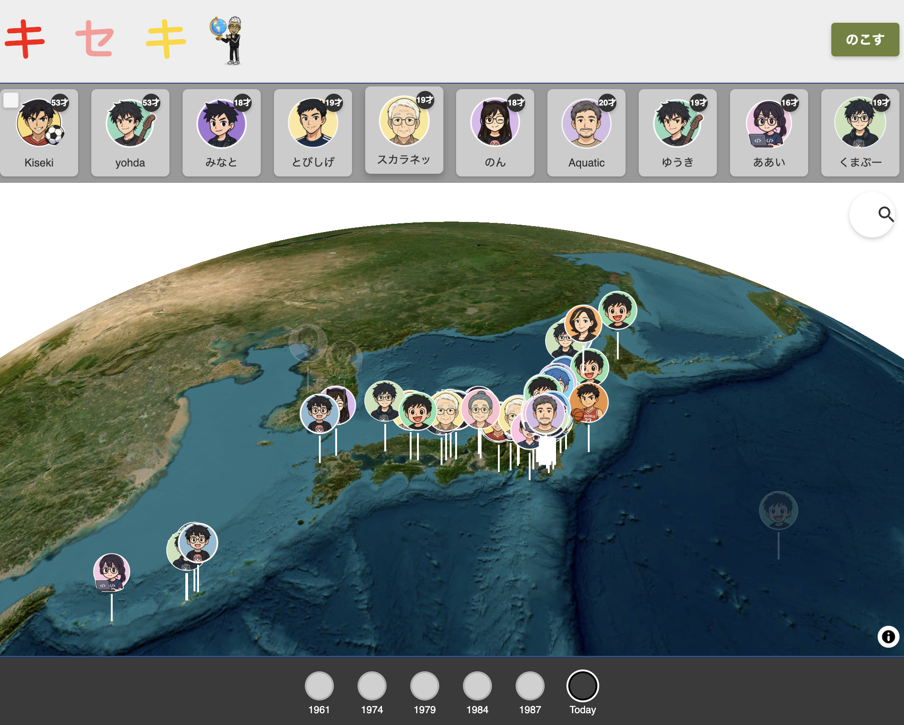
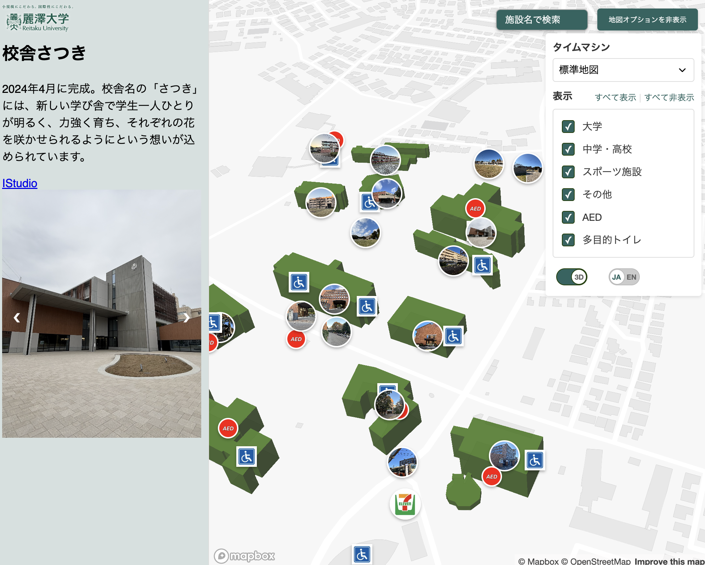
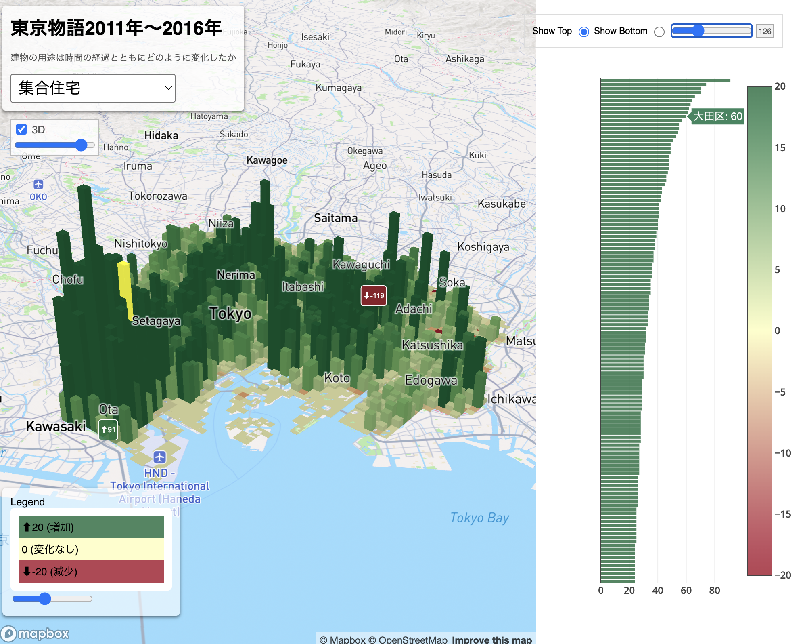
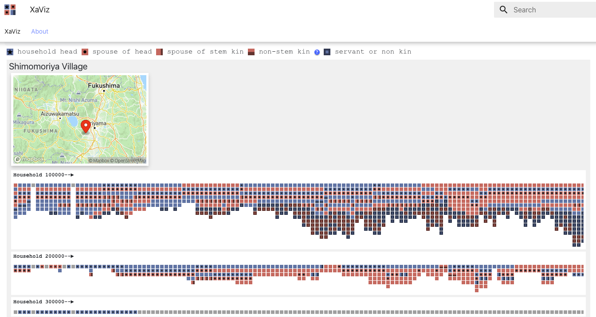
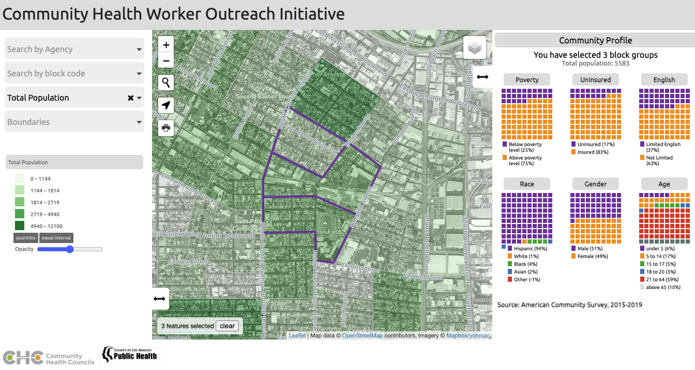
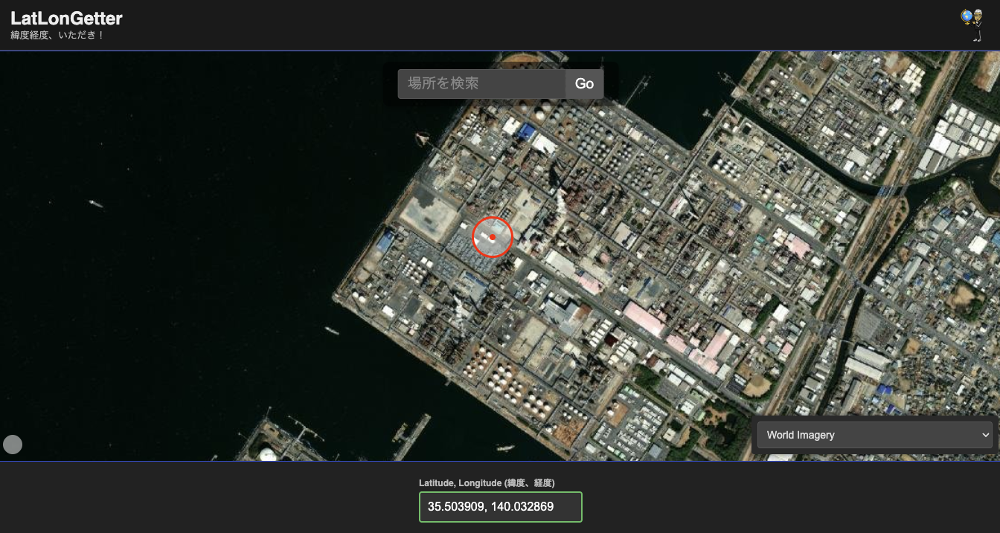
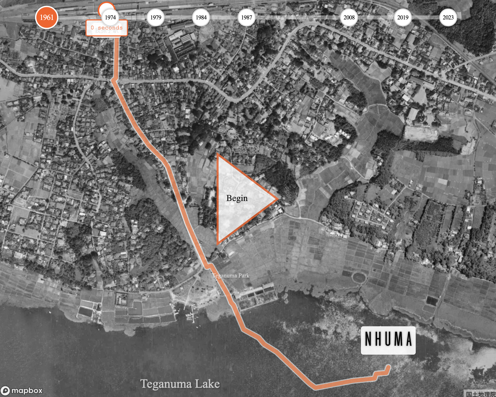
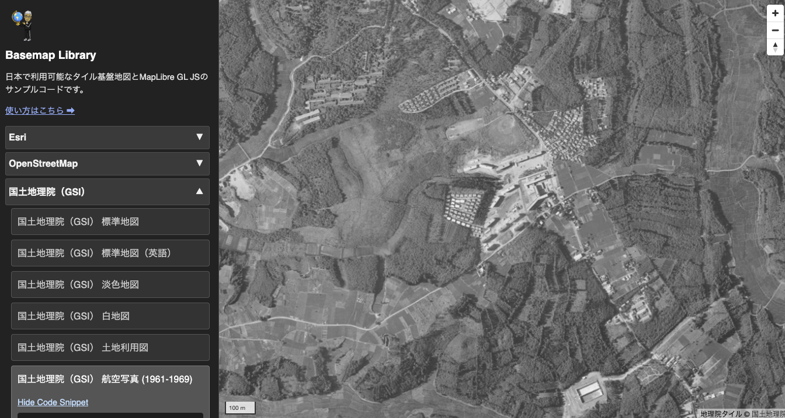
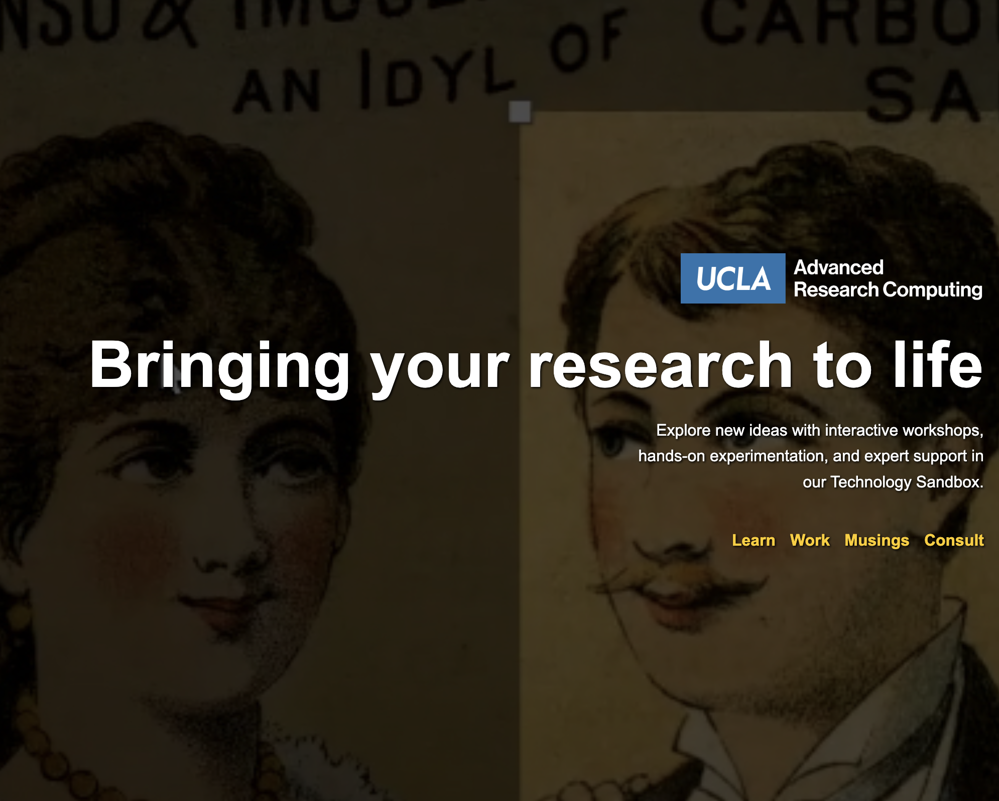

# Yoh Kawano – Project Gallery

A collection of interactive, map-based and narrative-driven web projects focused on spatial memory, education, and digital storytelling.

---

## KISEKI  
[Live site](https://yohman.github.io/kiseki/) | [GitHub](https://github.com/yohman/kiseki)

Trace and preserve memory through space. Kiseki connects generations by allowing users to geotag and share memories, creating a growing archive of community voices.

---

## Reitaku Campus Map  
[Live site](https://yohman.github.io/reitaku-map/) | [GitHub](https://github.com/yohman/reitaku-map)

An interactive campus map for Reitaku University. Built for clarity, exploration, and accessibility, with responsive design and building search features.

---

## HyperCities Map Library  
[Live site](https://yohman.github.io/maplibrary/) | [GitHub](https://github.com/yohman/maplibrary)

A curated archive of digital mapping projects from the HyperCities era. Updated for the modern web and grounded in digital humanities practice.

---

## 東京物語  
[Live site](https://yohman.github.io/xymax/) | [GitHub](https://github.com/yohman/xymax)

A narrative visualization of Tokyo’s urban transformation, created in collaboration with XYMAX. Combines data, storytelling, and interactive cartography.

---

## XaViz
[Live site](https://yohman.github.io/pfhp/web/site/) | [GitHub](https://github.com/yohman/pfhp)

XaViz transforms complex Japanese historical demographic records (SAC and NAC) into an accessible interactive visualization tool, democratizing specialized archival research and revealing diverse household structures that challenge assumptions about "traditional" Japanese families in the 18th-19th centuries.

---

## Community Health Worker Outreach Initiative
[Live site](https://yohman.github.io/chs-mapping/web/) | [GitHub](https://github.com/yohman/chs-mapping)

A project aimed at improving outreach and support for community health workers through interactive mapping and data visualization.

---

## Tokyo Parcels
[Live site](https://yohman.github.io/tokyo-parcels/) | [GitHub](https://github.com/yohman/tokyo-parcels)

A project visualizing parcel data in Tokyo, aimed at urban planners, researchers, and the general public interested in land use and urban development.

---

## LatLonGetter

[Live site](https://yohman.github.io/getlatlon/) | [GitHub](https://github.com/yohman/getlatlon)   

A simple tool to extract latitude and longitude coordinates from a map. Useful for educators, students, and developers needing quick geolocation data.

---

## Directions  
[Live site](https://yohman.github.io/directions/) | [GitHub](https://github.com/yohman/directions)

A simple direction-finding and route-planning demo. Built as an educational tool to illustrate spatial logic and interface design principles.

---

## Basemaps in Japan  
[Live site](https://yohman.github.io/basemap/basemap.html) | [GitHub](https://github.com/yohman/basemap)

Need a basemap for your interactive web map? This site offers a curated selection of publicly available basemaps, with a special focus on maps of Japan. Ideal for developers and educators building web map applications.

---

## UCLA Sandbox  
[Live site](https://yohman.github.io/sandbox-yoh/site/) | [GitHub](https://github.com/yohman/sandbox-yoh)

A creative lab for interactive mapping, web-based experiments, and student collaboration from UCLA coursework and workshops.

---

For questions or contributions, feel free to reach out at [ykawano@reitaku-u.ac.jp](mailto:ykawano@reitaku-u.ac.jp).